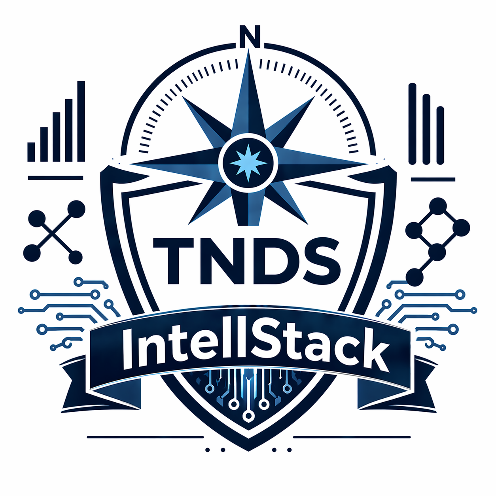

<div align="center">

# IntellStack
### Operator-Grade Skills Framework for Service Business Operations

[](README.md)
[](LICENSE)
[](https://truenorthstrategyops.com)



</div>

## What this is

Six interlocking skills that run the full lifecycle of a TNDS engagement — from go/no-go decisions through discovery, sales, delivery, and documentation. Each skill is a methodology plus prompts, templates, and workflows a Claude-powered agent can follow step-by-step.

Built for operators running small service businesses or consulting engagements. Not a marketing framework. Not theory. The playbook Jacob uses daily.

## What it does

- **Bearing Check** — 8-checkpoint decision validation. Runs before any major commitment.
- **ARO Assessment** — Agent-Ready Operations evaluation. Scores AI/automation fit.
- **World Model Mapper** — 5-phase process mapping. Surfaces the gap between the stated process and the real one.
- **Direction Protocol** — 5-stage sales process: IDENTIFY, DIAGNOSE, DESIGN, PROPOSE, CLOSE.
- **Command Protocol** — 12-phase delivery system. Turns a signed agreement into a shipped Command Center.
- **Documentation Skill** — Generates proposals, agreements, SOPs, and client-facing deliverables.

## How it works

```
                    ┌─────────────────┐
                    │  Bearing Check  │  decision gate
                    └────────┬────────┘
                             │
         ┌───────────────────┼───────────────────┐
         │                   │                   │
         ▼                   ▼                   ▼
   ┌──────────┐       ┌────────────┐       ┌──────────┐
   │   ARO    │──────▶│  Direction │──────▶│  Command │
   │Assessment│       │  Protocol  │       │ Protocol │
   └──────────┘       └──────┬─────┘       └─────┬────┘
        │                    │                   │
        └────────────────────┼───────────────────┘
                             ▼
                    ┌─────────────────┐
                    │  Documentation  │  deliverables
                    └─────────────────┘

            World Model Mapper runs underneath
            any skill that needs process depth.
```

## Quick start

This repo is documentation. Clone it, then point Claude Code, Claude Desktop, or any Claude-powered agent at the skill folder you need:

```bash
git clone https://github.com/TNDS-Command-Center/IntellStack.git
cd IntellStack
```

Each skill has its own `SKILL.md` and `USER_MANUAL.md`. Read the SKILL.md first — that is the contract. The USER_MANUAL shows it in use.

| Asking... | Use |
|---|---|
| Should I pursue this? | Bearing Check |
| How AI-ready is this operation? | ARO Assessment |
| What's really happening in this process? | World Model Mapper |
| How do I close this prospect? | Direction Protocol |
| How do I deliver for this client? | Command Protocol |
| How do I create this document? | Documentation |

## Project structure

```
IntellStack/
├── ARO-Assesment-Skill/         Agent-readiness scoring + context architecture
├── Bearing-Check-Skill/         Decision validation framework
├── Command-Protocol-Skill/      Delivery / implementation system
├── Direction-Protocol-Skill/    Sales process (IDENTIFY → CLOSE)
├── Documentation-Skill/         Proposal / agreement / SOP generator
├── World-Model-Mapper-Skill/    Process mapping, feedback loops, shadow vs. reality
├── docs/                        Public-facing documentation
├── CLAUDE.md                    Agent-facing project context
├── README.md                    This file
├── USER-MANUAL.md               End-user walkthrough
└── WORKFLOW_INTEGRATION.md      How the skills chain together
```

## License

MIT — see [LICENSE](LICENSE).

Framework names (Direction Protocol, Command Protocol, Bearing Check, World Model Mapper, ARO Assessment, Battle Rhythm Install, Command Center Build) are trademarks of True North Data Strategies LLC.

## Built by

Jacob Johnston | True North Data Strategies LLC | SDVOSB
